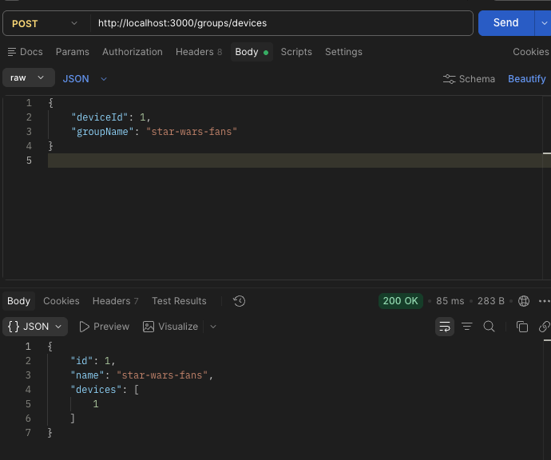
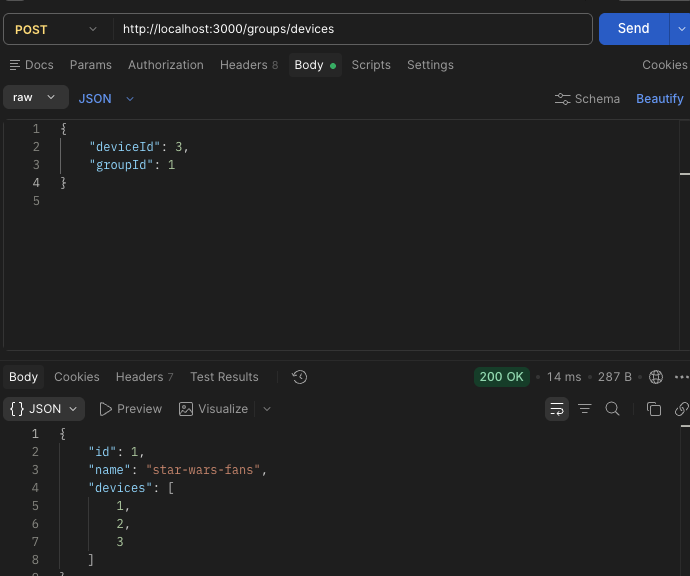
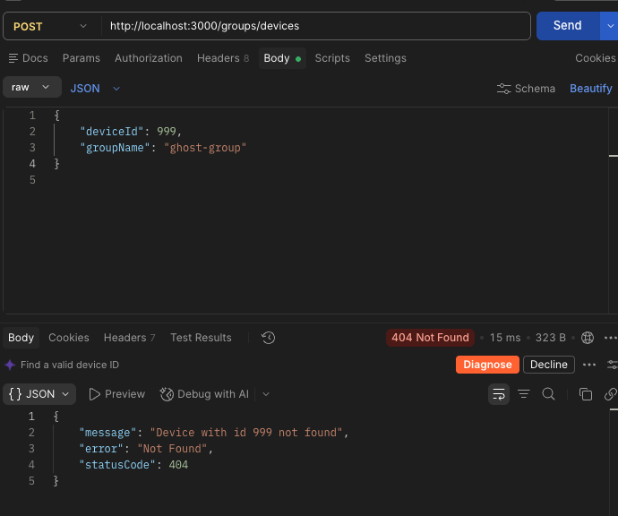
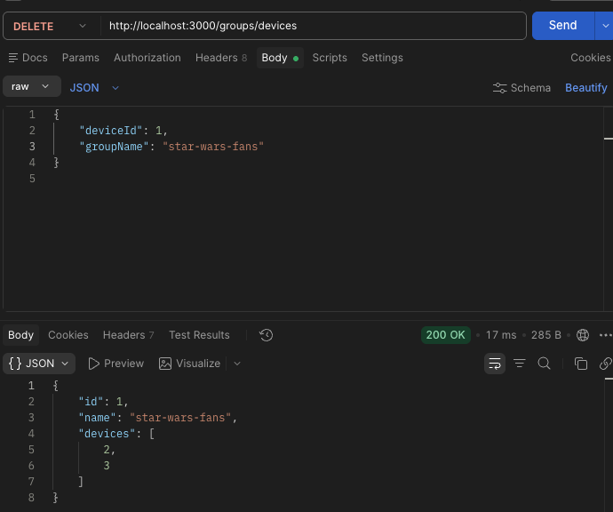
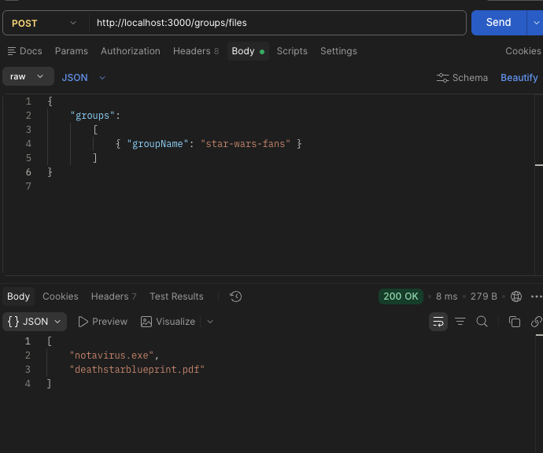

# ShowTimeVR Backend — Device/Group Service

A mock HTTP service for managing devices and groups, built with NestJS, TypeScript (`strict`), and [node-json-db](https://github.com/Belphemur/node-json-db) as the storage layer.

## Setup

```bash
npm install
```

## Running the app

```bash
# development
npm run start

# watch mode
npm run start:dev

# production mode
npm run start:prod
```

The server listens on `http://localhost:3000` by default (override with the `PORT` env var).

On first boot the database file (`db.json`, git-ignored) is created and seeded automatically with 3 devices and no groups:

```json
{
  "devices": [
    { "id": 1, "files": ["notavirus.exe", "deathstarblueprint.pdf"] },
    { "id": 2, "files": ["deathstarblueprint.pdf", "peterdinklagenudes.zip"] },
    { "id": 3, "files": ["peterdinklagenudes.zip", "keyboardcat.mp4"] }
  ],
  "groups": []
}
```

## Model

**Device**
- `id: number`
- `files: string[]`

**Group**
- `id: number`
- `name: string`
- `devices: number[]` — device ids

## API

All endpoints accept and return `application/json`. Request bodies are validated (`class-validator`); unknown fields are rejected (`400 Bad Request`).

A group is always identified by **either** `groupId` **or** `groupName` — never both, never neither.

### `POST /groups/devices` — add a device to a group

Creates the group if a `groupName` is given and no group with that name exists yet. Adding a device that's already in the group is a no-op. Returns the resulting group.

**Request**
```json
{
  "deviceId": 1,
  "groupName": "star-wars-fans"
}
```

**Response `200 OK`**
```json
{
  "id": 1,
  "name": "star-wars-fans",
  "devices": [1]
}
```



Adding another device to the same group by name reuses it instead of creating a duplicate:

**Request**
```json
{ "deviceId": 2, "groupName": "star-wars-fans" }
```

**Response `200 OK`**
```json
{
  "id": 1,
  "name": "star-wars-fans",
  "devices": [1, 2]
}
```


A group can also be targeted by `groupId` instead of `groupName`:

**Request**
```json
{ "deviceId": 3, "groupId": 1 }
```

**Response `200 OK`**
```json
{
  "id": 1,
  "name": "star-wars-fans",
  "devices": [1, 2, 3]
}
```



**Error — unknown device (`404 Not Found`)**

Request:
```json
{ "deviceId": 999, "groupName": "ghost-group" }
```

Response:
```json
{
  "message": "Device with id 999 not found",
  "error": "Not Found",
  "statusCode": 404
}
```



Other validation errors (`400 Bad Request`):
- Both `groupId` and `groupName` supplied.
- Neither `groupId` nor `groupName` supplied.
- Unknown fields in the body (e.g. `"extra": "nope"`).
- `groupId`/`groupName` referencing a group id that doesn't exist.

### `DELETE /groups/devices` — remove a device from a group

Removes the device from the group and returns the resulting group. If the group has no devices left, it is deleted from the database — the response still reflects its final (empty) state.

**Request**
```json
{ "deviceId": 1, "groupName": "star-wars-fans" }
```

**Response `200 OK`** (other devices remain)
```json
{
  "id": 1,
  "name": "star-wars-fans",
  "devices": [2, 3]
}
```



Removing the last device deletes the group:

**Request**
```json
{ "deviceId": 3, "groupId": 1 }
```

**Response `200 OK`**
```json
{
  "id": 1,
  "name": "star-wars-fans",
  "devices": []
}
```


**Error — unknown group (`404 Not Found`)**
```json
{ "deviceId": 1, "groupName": "nonexistent" }
```

### `POST /groups/files` — list files for devices in given groups

Accepts a list of group identifiers (mixing `groupId`/`groupName` across entries is fine) and returns the deduplicated list of files across every device in those groups.

**Request**
```json
{
  "groups": [{ "groupName": "star-wars-fans" }]
}
```

**Response `200 OK`**
```json
["notavirus.exe", "deathstarblueprint.pdf"]
```



Multiple groups (files deduplicated across all their devices):
```json
{
  "groups": [{ "groupId": 1 }, { "groupName": "another-group" }]
}
```

**Error — unknown group (`404 Not Found`)**
```json
{ "groups": [{ "groupName": "nonexistent" }] }
```

## Project structure

```
src/
  database/     # node-json-db wrapper (DatabaseService), collection enum, seed data
  device/       # Device model + DeviceService (read-only data access)
  group/        # Group model, DTOs, GroupService (business logic), GroupController (HTTP)
```

## Tests

```bash
npm run test        # unit tests
npm run test:cov    # coverage
npm run test:e2e    # e2e / black-box tests
```

Both scripts already carry the Node flags this stack needs to actually run (NestJS 12's packages are ESM-only, and Node 25's new global `localStorage` needs an explicit opt-out) — no extra setup required.

### Unit tests

Colocated `*.spec.ts` files per module, with `DatabaseService`/`DeviceService` mocked out:

- `src/device/device.service.spec.ts` — device lookup, 404 on unknown id, id deduplication.
- `src/group/group.service.spec.ts` — group creation vs. reuse-by-name, idempotent add, group deletion once emptied, deduplicated file aggregation, all the 404 paths.
- `src/group/group.controller.spec.ts` — controllers correctly delegate to `GroupService`.

### E2E / black-box tests

`test/groups.e2e-spec.ts` boots the real `AppModule` (with the same global `ValidationPipe` as production) and drives it purely over HTTP with `supertest` — no service is mocked, and each test resets the database to the seed fixture first so ordering never matters. It covers, per endpoint:

- **`POST /groups/devices`** — create-on-first-use, reuse-by-name (no duplicates), targeting by `groupId`, idempotent re-add, 404 on unknown device/group, 400 on both/neither identifier, 400 on unknown fields (whitelist), 400 on a non-integer `deviceId`, and 400 for `groupName` values containing disallowed characters (path traversal, brackets, `<script>` tags — the injection-style cases the validation is meant to block).
- **`DELETE /groups/devices`** — removal keeps the group alive while other devices remain, deletes it once empty, and confirms the deleted group is genuinely gone (a later reference to it 404s); 404 for an unknown group.
- **`POST /groups/files`** — deduplicated file listing across a single group and across multiple groups mixing `groupId`/`groupName`, 404 for an unknown group, 400 for an empty `groups` array, and 400 for a nested group entry with both identifiers or an unknown field.
